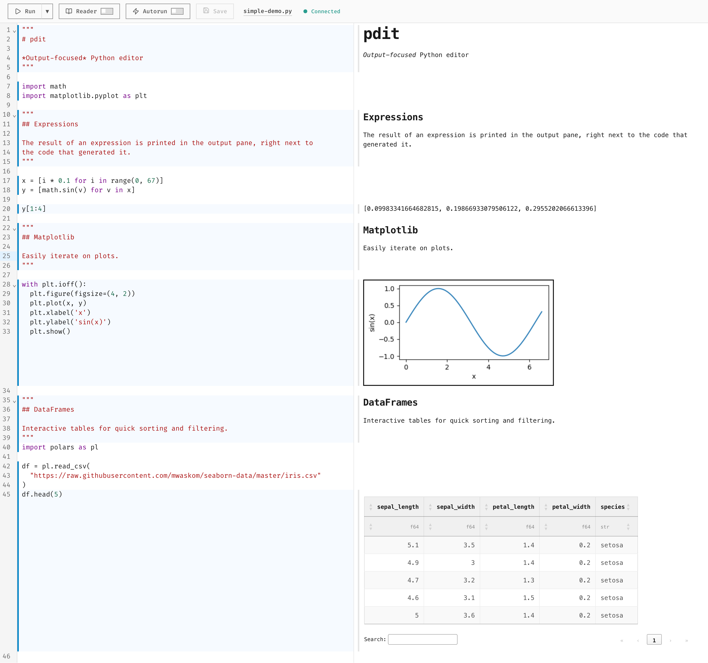

# pdit: Python Un-Notebook

pdit is a Python Un-Notebook: an output-focused Python editor for plain `.py` files. Run code statement by statement and see output inline beside the exact line that produced it, with notebook-like iteration but no notebook cells, no notebook file format, and no conversion step. The workflow is expression-first, so top-level expressions render by default and intermediate states stay visible. Keep pdit open while Claude Code, Cursor, or similar tools edit your script on disk.



## Quick Start

```bash
pip install "pdit[demo]"
pdit --demo
```

With [uv](https://docs.astral.sh/uv/):

```bash
uvx --with "pdit[demo]" pdit --demo
```


## Manual

See the [website](https://pdit.dev/manual/).

## Development

See [DEVELOPMENT.md](DEVELOPMENT.md) for development setup and testing.
